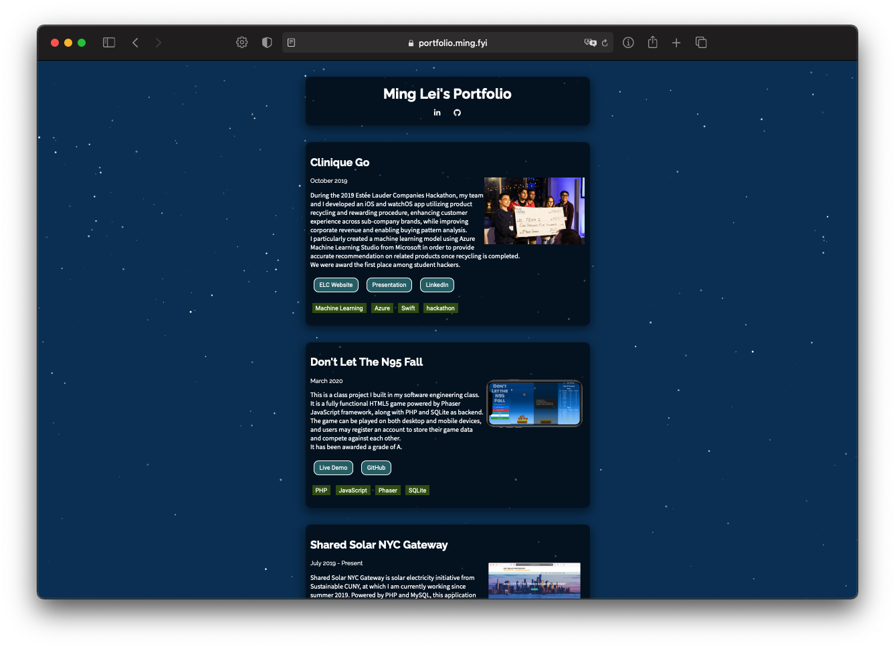

# portfolio-page

  

A hand-crafted portfolio page used to showcase some of the highlighted projects.

## Table of Contents

- [Description](#description)
- [Status](#status)
- [Browsers Support](#browsers-support)
- [Installation](#installation)
- [Contributing](#contributing)
- [Privacy](#privacy)
- [License](#license)

## Description

Inspired by multiple friends and questions encountered during job applications, this page is created in order to serve as a centralized destination to showcase some of the highlighted projects I have made in previous years.

It's live on [portfolio.ming.fyi](https://portfolio.ming.fyi/)

## Status

This project is currently under development and will be updated when necessary.

## Browsers Support

|  IE / Edge |  Firefox |  Chrome |  Safari |  iOS Safari |  Opera |
| --------- | --------- | --------- | --------- | --------- | --------- |
| Edge| last version| last version| last version| last 2 versions| last version

## Installation

1. Have a server or host to serve static files, which should be publicly accessible.
2. `git clone https://github.com/popoway/portfolio-page.git` to get the code.
3. You're all set!

Note: When developing locally, use a local server (like the one supplied [here](https://github.com/popoway/portfolio-page/blob/master/server.js), run with `npm ci ; node server.js`) to avoid CORS errors.

## Contributing

Feel free to open a pull request for your ideas on how this page can be improved.

To report a security vulnerability, please review the [Security Policy](https://github.com/popoway/portfolio-page/blob/master/SECURITY.md).

## Privacy

This page uses cookies from Cloudflare, Google and popowayCloud to deliver its services and to analyze traffic. popoway respects your privacy. Please review the [Privacy Policy](https://github.com/popoway/portfolio-page/blob/master/PRIVACY.md) for more information on how your data is handled.

## License

[MIT](https://popoway.mit-license.org/)
